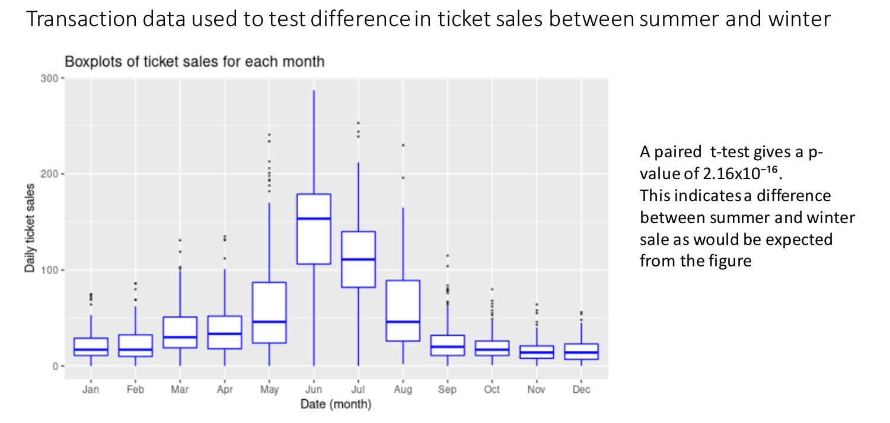

# Ticket sales for a swimming pool

How can we use transaction data to test whether a difference in the daily volume of sales can be found between summer and winter time? 

This case study uses the swim_work.csv dataset which can be found here: https://osf.io/jcxmk/. The data includes information on daily ticket sale of an outdoor swimming pool operating in Albuquerque (New Maxico, USA). The dataset has n = 2522 observations.

https://osf.io/s3ng2/

